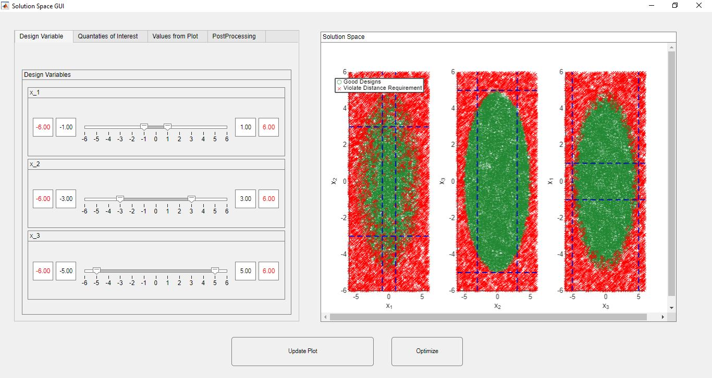
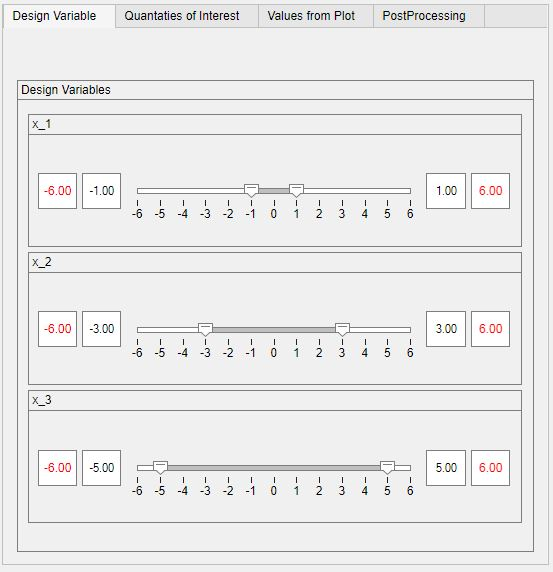
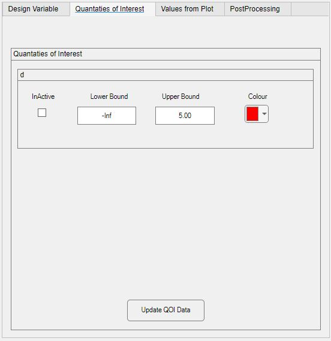
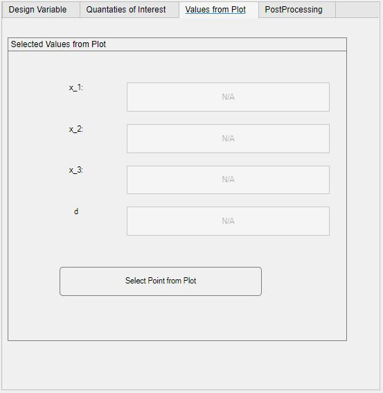
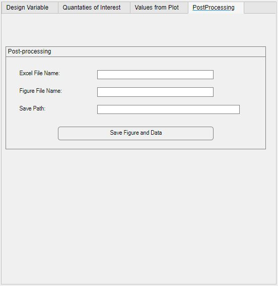
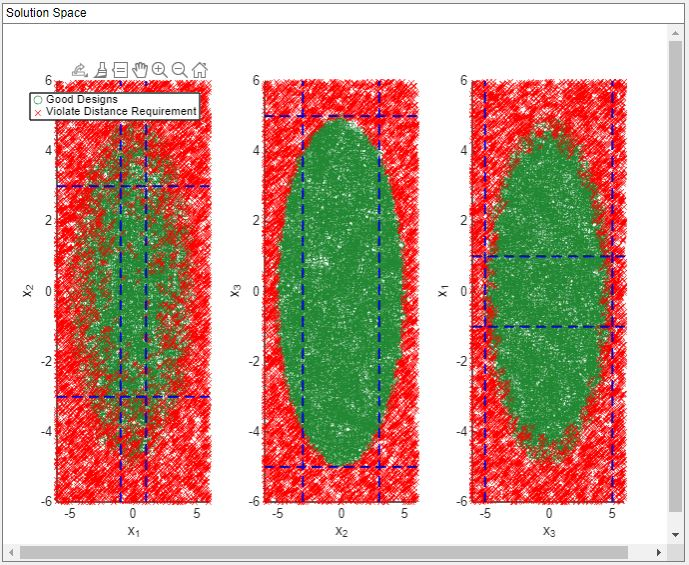

# Solution Space Engineering Tool

## Overview
The **Solution Space Engineering Tool** is an interactive MATLAB-based tool that enables users to visually explore and interact with complex solution spaces. It leverages MATLAB's App Designer and UI components to provide a rich graphical interface for navigating design variables, constraints, and system outputs in real time.

This tool is ideal for design-space exploration, constraint sensitivity studies, and visual decision-making in multi-variable optimization problems.

---

## Features

- 🧭 **Graphical Navigation of Design Space**  
  Visually explore feasible and infeasible regions in high-dimensional spaces.

- 🎛️ **Interactive MATLAB GUI**  
  Built using `uifigure`, `uitabgroup`, `uipanel`, `uisliders`, dropdowns, checkboxes, and color pickers.

- 📈 **Dynamic Visualization of Quantities of Interest (QoIs)**  
  Real-time plots of system outputs, design feasibility, and trade-off curves.

- 🛠️ **Live Input Control**  
  Draggable box shape design space, sliders and input boxes for modifying design variables, with immediate feedback.

- 🌈 **Customizable Appearance**  
  Change colors, markers, and plot styles through a built-in UI.

- 🔄 **Modular Design**  
  Easily extendable to support different system functions (MATLAB or Python).

---

## Screenshots

### 🎯 Full Interface Layout  
*Tabbed interface with inputs, plots, and settings.*



---

### 🔧 Design Variable Panel  
*Adjust variables with sliders/text boxes and immediately see how outputs respond.*



---

### 📊 QoI Visualization  
*Decide which quantities of interest to display and modify their associated values directly within the solution space interface.*



---

### 📍 Point-Wise Data Extraction
*Interactively click on the plot to inspect and extract data at specific coordinates.*



	Note: First the button to select the point needs to be toggled on before clicking on the axeses

---

### 💾 Save & Export Data
*Save selected points (e.g., good/bad design candidates) along with associated solution space figures.*
- Export complete plots or filtered data for post-processing or reporting.
- Store generated figures as image files for documentation or presentations.



---

### 📊 Solution Space Figure
*Interactive figure for exploring the solution space in detail.*
- Includes a scrollable panel for navigating multiple variable pairs or dimensions.
- Features a draggable design box to define and adjust regions of interest.
- Supports zooming and panning for closer inspection of dense regions.
- Helpful for identifying valid and invalid zones based on user-defined limits.



---

## Project Structure
```markdown

SolutionSpaceToolbox/
  GUI/                     # Self made MATLAB UI components
    superSlider.m          # Dual sided slider
  Images/                  # Images included in the Readme.md
  InputReadingFunctions/   # Functions to parse and store data files
    excel_parser_xray_tool.m    # Parses problem data from excel files
    createBottomUpMappingFiles.m 
  ProblemDefinition/       # Stores excel files containing engineering problems
    XRayInput.xlsx         # Example excel files
  SavedFiles/              # Stored good/bad points and session outputs
  sso-toolbox/             # Subfolder developed in collaboration with Eduardo Rodrigues Della Noce
  Systems/                 # Custom objective function definition 
  TestScripts/             # Example script to run the *Solution Space Engineering Tool*
  UIFunctions/             # Stored callbacks used by the GUI
  setup_xray_toolbox.m     # Script to add paths and initialize environment
  README.md                # Project overview and documentation

---

## Requirements
- MATLAB 2019b or newer

---

## Inputs
1. Name of excel file containing the problem definition -> "XRayInput_new" for test
2. Function number -> "12" for test
	Note: Function needs to be added in the *Systems/*

---

## Authors and Acknowledgment
**Eduardo Rodrigues Della Noce (Supervisor, Main Author)**
**Ali Abbas Kapadia (Contributor)**
